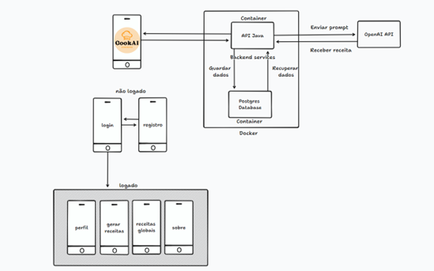
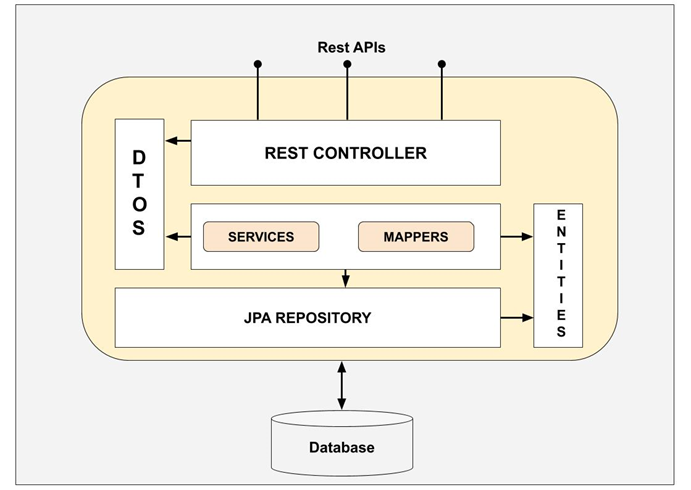

# CookAI

## 1. Introdução

Combata a fome global com o CookAi: um aplicativo revolucionário com um toque de inteligência artificial. Gerencie alimentos de forma eficiente, crie receitas incríveis e evite desperdícios. Chega de pensar "o que vou cozinhar hoje?" - o CookAi torna a tarefa fácil e divertida!

## 2. Vídeo

https://www.youtube.com/watch?v=aH7zKlzqBIQ

## 3. Endpoints

### 3.1 AuthController

- **Endpoint:** POST /login
- **Descrição:** Este endpoint é utilizado para autenticar o usuário.
- **Corpo da Solicitação:** O corpo da solicitação deve ser um JSON contendo o login e a senha do usuário.
  
  **Requisição:**
  ```json
  {
    "login": "neurotrix@example.com",
    "password": "teste123"
  }
  ```
  
**Resposta:** Caso a autenticação seja um sucesso, é retornado um JWT de autenticação com validade de 30 minutos.

### 3.2 RecipeController

- **Endpoint:** POST /recipe
- **Descrição:** Este endpoint é utilizado para o usuário enviar os ingredientes que serão utilizados para a criação da receita.
- **Corpo da Solicitação:** O corpo da solicitação deve ser um JSON contendo a mensagem do usuário.

 **Requisição:**
  ```json
  {
    "ingredientes": "macarrão gravata, tomate, sal, pimenta, salsicha",
    "dificuldade": "facil",
    "tempoMaximo" : "60 minutos"
  }
  ```

**Resposta:** Em caso de sucesso, é retornada a resposta do modelo de inteligência artificial “GPT-3.5-turbo”

- **Endpoint:** GET /recipe?pageNumber=0
- **Descrição:** Este endpoint é utilizado para obter as receitas enviadas pelo usuário utilizando o parametro "pageNumber" = 0.

 **Requisição:**
  ```URL
   GET http://localhost:8080/recipe
  ```
**Resposta:** Em caso de sucesso, retorna uma lista de receitas enviadas pelo usuário com as respostas do modelo de inteligência artificial.

### 3.3 UserController

- **Endpoint:** POST /user/register
- **Descrição:** Este endpoint é utilizado para registrar um novo usuário.
- **Corpo da Solicitação:** O corpo da solicitação deve ser um JSON contendo as informações do usuário (nome, login, senha, etc.).

 **Requisição:**
  ```json
{
  "name": "Leandro",
  "email": "neurotrix@fiap.com",
  "password": "teste123"
}
  ```

**Resposta:** Retorna 200 OK caso o usuário seja criado corretamente

- **Endpoint:** GET /user/all 
- **Descrição:** Este endpoint é utilizado para obter uma lista de todos os usuários.

 **Requisição:**
  ```URL
   GET http://localhost:8080/user/all
  ```
  
**Resposta:** Em caso de sucesso, retorna uma lista de todos os usuários.

## 4. Arquitetura da solução



## 5. Arquitetura da Aplicação



## 6. Conexão com a API OpenAI

A conexão com a API OpenAI é realizada utilizando a biblioteca openai-java, que permite realizar requisições POST à API, especificando o prompt, o modelo e os tokens máximos.

Exemplo da requisição em JAVA :

```java
    public RecipeDto sendMessageGpt(RecipeCreationDto recipeDto) {
        List<ChatMessage> messages = Arrays.asList(
                new ChatMessage(ChatMessageRole.SYSTEM.value(), PromptConstants.RECIPE_INITIALIZER),
                new ChatMessage(ChatMessageRole.USER.value(), PromptConstants.RECIPE_FORMAT),
                new ChatMessage(ChatMessageRole.USER.value(), PromptConstants.OUTPUT_RULES),
                new ChatMessage(ChatMessageRole.USER.value(), PromptConstants.OUTPUT_EXAMPLE),
                new ChatMessage(ChatMessageRole.USER.value(), PromptConstants.RECIPE_LEVELS),
                new ChatMessage(ChatMessageRole.USER.value(), PromptConstants.LINE_SEPARATOR),
                new ChatMessage(ChatMessageRole.USER.value(), PromptConstants.RECIPE_CREATOR + recipeDto.getIngredients()),
                new ChatMessage(ChatMessageRole.USER.value(), PromptConstants.RECIPE_DIFFICULTY + recipeDto.getDifficulty()),
                new ChatMessage(ChatMessageRole.USER.value(), PromptConstants.MAX_TIME + recipeDto.getPreparationTime())
                );

        ChatCompletionRequest chatCompletionRequest = ChatCompletionRequest
                .builder()
                .model("gpt-3.5-turbo")
                .messages(messages)
                .n(1)
                .maxTokens(650)
                .build();
    }
```
